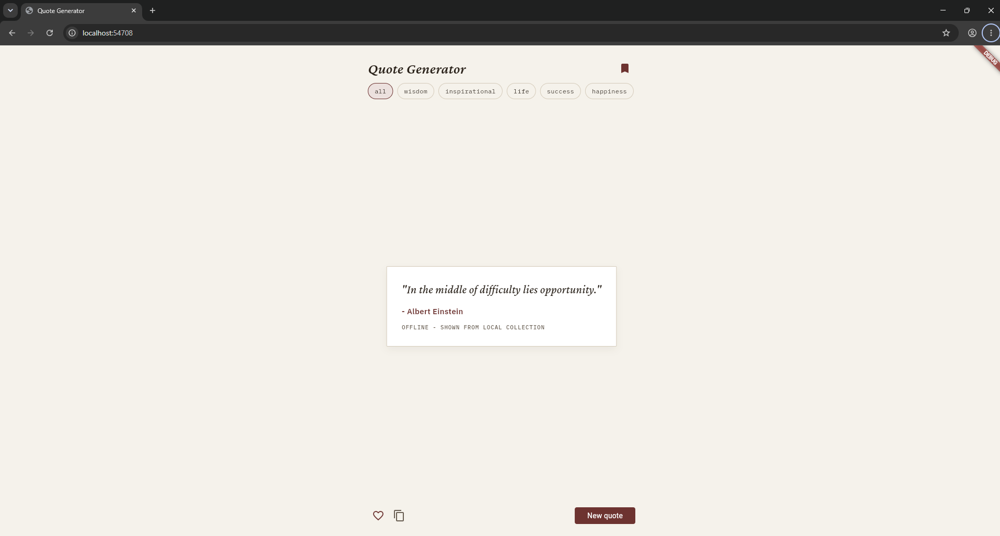
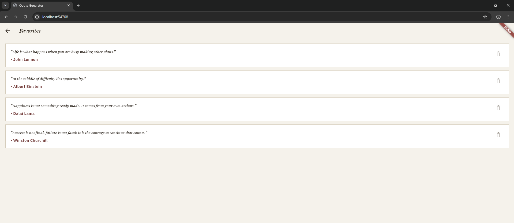

# Flutter Quote Generator


A quote generator that fetches real quotes from a public API, with
category filtering, favorites you can save and revisit, and a graceful
offline fallback when the network is unavailable.

## Screenshots

**Home screen - category filters, quote card, actions**



**Favorites screen - saved quotes, persisted across sessions**



## Why I rebuilt this

The original version was a single screen with a static, hardcoded list
of quotes - fine as a first Flutter exercise, but it didn't touch
networking, error handling, or persistence. This version does all three,
while keeping the same core idea.

## Features

- **Live quotes** from the [Quotable API](https://api.quotable.io), filterable by category (wisdom, inspirational, life, success, happiness)
- **Offline fallback**: if the network request fails, the app falls back to a small built-in quote collection instead of crashing or showing a blank screen - and says so clearly, rather than pretending the fallback quote came from the API
- **Favorites**: save quotes with a tap, view them on a separate screen, remove them individually - persisted with `shared_preferences` so they survive closing the app
- **Search favorites** by author or keyword
- **Quote of the day**: the first quote shown each day is cached and stays the same on every app open that day, even after restarting; tapping "New quote" browses freely without changing that day's cached quote
- **Dark mode**, toggled from the top bar, persisted so it's remembered next time the app opens
- **Share** a quote to any other app installed on the device (falls back to copying to clipboard if sharing isn't available on the platform)
- **Copy to clipboard** for sharing a quote elsewhere
- **Smooth fade transition** when a new quote loads, instead of an instant swap

## Setup and run

Requires the Flutter SDK installed.

```bash
flutter pub get
flutter run
```

To run in a browser without an emulator:

```bash
flutter run -d chrome
```

## How it's structured

```
lib/
    main.dart              app entry point, dark mode state, home screen
    quote_model.dart        Quote data class
    quote_service.dart      API call to Quotable, with local fallback data
    favorites_storage.dart  favorites persistence using shared_preferences
    daily_quote_storage.dart  caches the day's first quote by date
    theme_storage.dart      persists the dark mode preference
    favorites_screen.dart   list of saved favorites, with search
    theme.dart              color palette (light/dark) and typography
```

`QuoteService.fetchRandomQuote()` tries the live API first; if it fails
for any reason (no connection, timeout, non-200 response), it falls back
to a small bundled list of quotes filtered by the same tag, so the app
always shows something instead of an error screen.

## Testing status

The previous version of this app (live quotes, categories, favorites,
offline fallback) was fully run and confirmed working - see the
screenshots above.

Dark mode, quote-of-the-day caching, favorites search, and the share
button are new in this version and have **not** been run against the
real Flutter SDK yet. The code compiles logically and the structure of
every file was checked (balanced brackets, no leftover references to the
old color system), but this is not the same as confirming it actually
runs. Before relying on this version, run `flutter pub get` (to fetch
the new `share_plus` package), then `flutter analyze`, then `flutter
run`, and check specifically:

- Toggling dark mode changes the whole app's colors, and stays dark
  after fully closing and reopening the app
- Typing in the Favorites search box actually filters the list
- The share button opens a real share option (or falls back to copying,
  without crashing, if sharing isn't supported in that environment)
- The quote shown on first open today is still the same one on a second
  open the same day (this one is hard to fully verify quickly since it
  depends on the calendar date, but at minimum confirm it doesn't crash
  and shows some quote)

## Possible extensions

- Search favorites by author or keyword
- Share button (share_plus) to send a quote to another app
- Daily quote notification
- Dark mode toggle

## Tech stack

Flutter, Dart, Quotable API, shared_preferences
